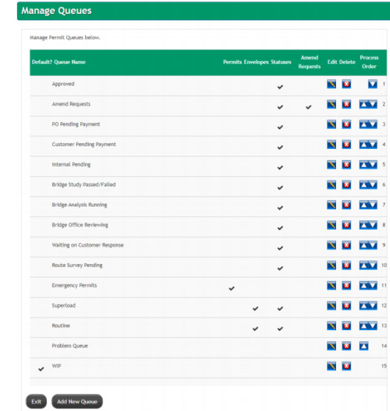
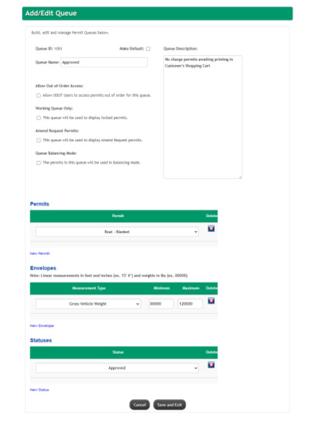
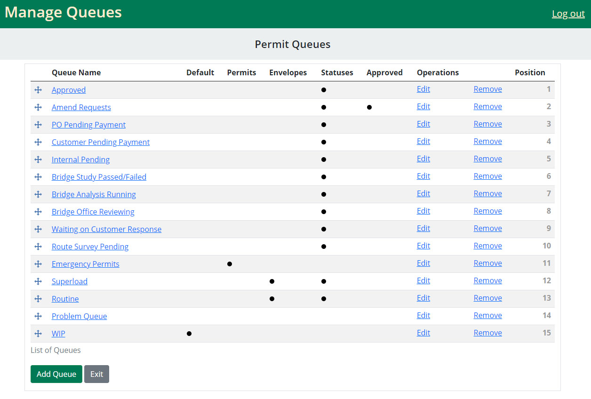
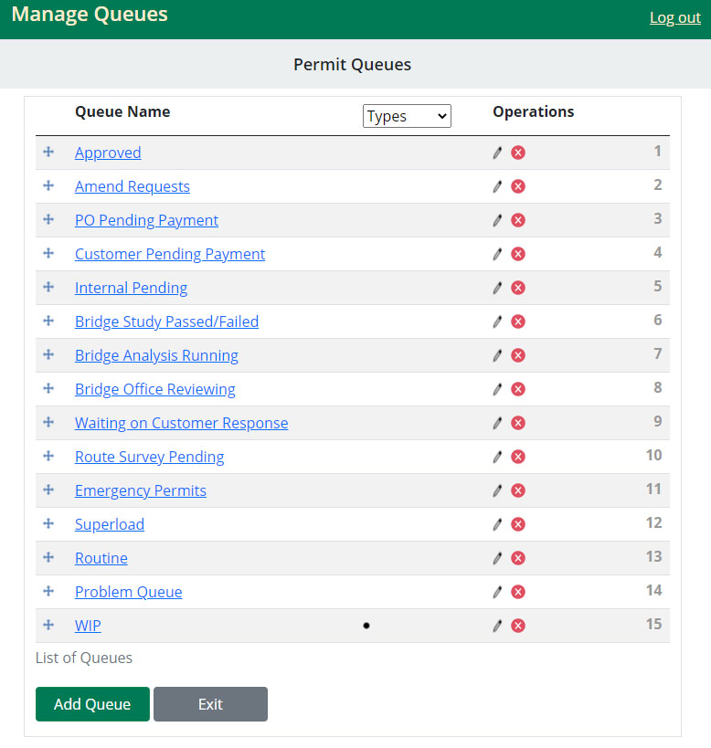
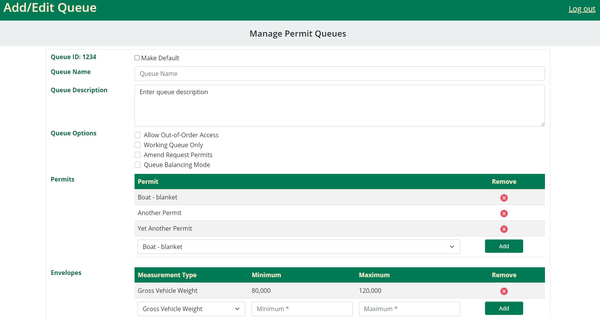

# Queuing System Redesign

Below is a description of a webpage that needs to be redesigned for better user experience. Your job will be to redesign
both the Manage Queues and Add / Edit Queues pages.

## Deliverables
Create a webpage(s) that is representative of the original version, but includes the following improvements:

- Improve the look and feel so that it both looks more attractive, but is also easier to use.

- Include accessibility features such as labeling form controls, alternative text for images, and ensuring that all
interactive parts of the page are keyboard accessible.

-  The content should be responsive to the size of the page in such a way that it both looks good and is still easy to
use on a variety of screen sizes.

The deliverables should be viewable from a web browser such as Chrome or Edge. It only needs to contain enough
functionality to demonstrate the design of the user interface. It does not need to implement any sort of backend work,
such as editing and persisting information. Any data that needs to appear on the page(s) can be statically defined. If
multiple web pages are required links between the pages should work.

## Limitations
The deliverable must be in HTML, and can use Javacript, Bootstrap, jQuery, and CSS. No other libraries or frameworks
can be used.

## Additions/Edits
- Three responsive views with icons used for smaller views on main page.
- Drag and drop positioner.
- Cleaner icon choices.
- Edit page - Incorporated all the fields in to one form for unification.
- On both pages - included a row hover to help the eye track the row content.
- Edit page - When a choice is selected from the drop-down menus, another row can appear.  
- [Cooler Color Checker](https://coolors.co/contrast-checker/) Colors pass 
- Labels included.
- I chose main colors to contrast with at least 4/1 ratio foreground/background.
- Options and links are keyboard-navigable.
- HTML and CSS optimized for Chrome and MS Edge.
- I kept main font mostly at 16px to make it easier to read for those with visual impairments (like myself).

## Recommendations

- Option to toggle between drop-down select menu positioning (can be added as a feature)
- On the main page, I recommend a JQuery toggle between permit-types (as indicated by the drop-down menu on the mobile view).  This can be added as feature.
- I recommend form validation/automatic field formatting for any fields, such as envelopes, which require the User to enter specific types of measurements.
- With additonal time I would make more styling/coding touch-ups such as 
    1. Finalizing the color scheme further; 
    2. Tinkering with Bootstrap's css a bit more to uncover more drag and drop styling functionality as well as style hover class; and, 
    3. JQuery functionality for drop-down hide/show columns for all responsive views (I started this but it would require more time so I abandoned feature for now.)    

## User Story

- AS A permit officer (USER) who has a list of queues(permit request (s))
 and uses a webpage to display and manage requests,
- I WANT a table that displays the list of queues with the following 
items:
- Queue Name
- Permits (indicated if they exist)
- Envelopes (indicated if they exist)
- Status (which status)
- Amend requests (if they exist)
- Edit link
- Remove link
- Priority indicator (which user can interface to change order)
- SO THAT the USER can add/remove/edit/update permit queues.
- EXIT and ADD NEW QUEUE buttons sit at the bottom of the page 
- SO THAT the USER can add/remove/edit/update permit queues.
- IF ADD or EDIT is selected, the USER is taken to a second page
 (ADD/EDIT page) where data is added or modified

## Media
BEFORE 

 

 

AFTER 

 

 

 

# Website

[Github Pages](https://github.com/webprinc3ss/queuing-system-ui-redesign)

 

## Credits/Software
- Bootstrap 5.
- JQuery.
- icons8.com - All icons from icons8.  If you wish to use, you must either give credit or purchase.
